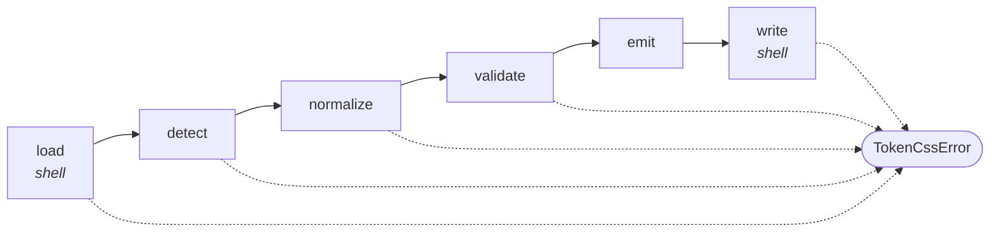
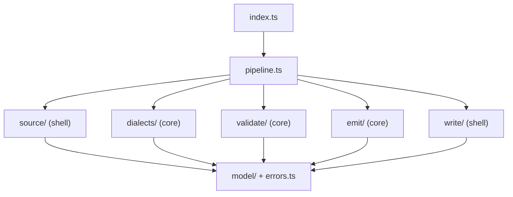

# Architecture Spine — css_generator_library

## Design Paradigm

**Pipes and filters with a functional core and an imperative shell.**

Conversion is one linear pipeline of six stages. The four middle stages are pure functions
(`in → out`, no IO, no clock, no randomness); the first and last stages are the only code allowed to
touch the network or the filesystem.



Layer → directory mapping:

| Paradigm role | Directory | May import |
| --- | --- | --- |
| Public surface | `src/index.ts` | everything |
| Orchestrator | `src/pipeline.ts` | all stages; no `node:fs`, no `node:https` |
| Shell (input) | `src/source/` | `node:fs`, `node:https`, `node:net`, `node:dns` |
| Core | `src/dialects/`, `src/validate/`, `src/emit/` | `src/model/`, `src/errors.ts` only |
| Shell (output) | `src/write/` | `node:fs` |
| Shared model | `src/model/`, `src/errors.ts` | nothing |



Dependencies point one way, toward `model/`. Nothing in `dialects/`, `validate/`, or `emit/` may
import `node:fs` or any networking builtin.

## Invariants & Rules

### AD-1 — The pipeline is the only control flow

- **Binds:** all FRs
- **Prevents:** stages calling each other ad hoc; a shortcut path that skips validation before writing.
- **Rule:** `pipeline.ts` runs the six stages in fixed order and is the only place that sequences them. A stage receives the previous stage's output and returns the next stage's input — never a callback into a later stage.

### AD-2 — One internal representation at every stage boundary

- **Binds:** FR-4, FR-8, FR-17, FR-18, FR-9, FR-10
- **Prevents:** the validator or the emitter re-sniffing `$value` vs `value`; dialect knowledge leaking downstream.
- **Rule:** Normalizers are the only code that reads dialect-specific keys. Everything after `normalize` sees only the IR:

  ```ts
  type TokenRef  = { kind: 'ref';    path: string[] }
  type TokenLit  = { kind: 'literal'; value: string | number }
  type TokenNode = { path: string[]; value: TokenRef | TokenLit }
  type TokenDoc  = { tokens: readonly TokenNode[] }   // document order
  ```

  The IR deliberately carries **no** `$type`, `$description`, or `$extensions`. V1 emits the scalar
  as written and infers nothing from type (see AD-19), so threading type metadata downstream would
  only invite inference that the PRD forbids.

### AD-3 — The Format Allowlist is a closed, ordered registry — not an if-chain

- **Binds:** §4.2.0, FR-4, FR-14, FR-17, FR-18, SM-C3
- **Prevents:** non-deterministic detection; the allowlist growing by scattered patches.
- **Rule:** Each allowlisted shape is one registry entry `{ id, matches(doc), normalize(doc) }`. The registry is an ordered array evaluated first-match-wins in precedence order **A3 → A1 → A2**; falling off the end is `FORMAT_NOT_ALLOWED`. Adding a shape means adding one entry plus accept/reject fixtures — no other file changes.

### AD-4 — One error type, codes are the contract

- **Binds:** §4.4, §8, FR-12–FR-15, FR-19–FR-22
- **Prevents:** callers string-matching messages; a mix of thrown errors, returned `null`, and rejected promises.
- **Rule:** Every failure throws `TokenCssError` carrying `code` from the frozen `FailureCode` object, plus `source` and (when token-scoped) `tokenPaths`. No error subclasses. No stage returns a sentinel value for failure. Codes are `SCREAMING_SNAKE`, exported from `src/errors.ts`, and renaming or merging one is a major version bump.

  | Code | FR |
  | --- | --- |
  | `SOURCE_UNREADABLE` | FR-12 |
  | `SOURCE_INVALID_JSON` | FR-13 |
  | `FORMAT_NOT_ALLOWED` | FR-14 |
  | `ALIAS_CYCLE` | FR-15 |
  | `ALIAS_DANGLING` | FR-22 |
  | `COMPOSITE_VALUE` | FR-20 |
  | `NAME_COLLISION` | FR-21 |
  | `OUTPUT_WRITE_FAILED` | FR-19 |

### AD-5 — Fail-closed, one class at a time, exhaustively

- **Binds:** §4.4 shared consequences, Reliability NFR
- **Prevents:** whack-a-mole error reporting; a run that fixes one token only to fail on the next; inconsistent aggregation between validators.
- **Rule:** Validation passes run in fixed order — structure → dialect → composites → alias graph → naming/collision. **Each pass walks the whole document and reports every offender of its class**; the first failing pass aborts the pipeline. No pass returns a partially valid `TokenDoc`.

### AD-6 — Nothing is written until the whole output exists in memory

- **Binds:** FR-2, FR-19, Reliability NFR
- **Prevents:** a streaming emitter leaving a half-written Styles File when validation fails late.
- **Rule:** `emit` returns the complete CSS string. `write` is the first and only code that opens the output path, and it runs after every validation pass has passed.

### AD-7 — Atomic replace, same directory

- **Binds:** FR-2, FR-19, Atomicity NFR
- **Prevents:** a truncated Styles File; a cross-device `rename` failure; orphaned temp files.
- **Rule:** Write to `<target>.<random>.tmp` **in the target directory**, `fsync`, then `rename` into place. On any failure, unlink the temp file and leave the pre-existing Styles File untouched. Never write the temp file to `os.tmpdir()`.

### AD-8 — All network policy lives in one guarded adapter, built on `node:https` — not `fetch`

- **Binds:** FR-1, FR-12, Security NFR (§9), AD-13
- **Prevents:** each call site reinventing timeout/size/redirect policy; a redirect hop escaping the guard; DNS rebinding between the address check and the connect (SSRF).
- **Rule:** `src/source/http.ts` is the only module that opens a socket. It uses `node:https.request` with a **custom `lookup`** that validates the resolved address and returns it, so the socket connects to the address that was actually checked. Range checks use `node:net.BlockList` (loopback, link-local, private, and cloud-metadata ranges), never regexes, and cover IPv4-mapped IPv6. Redirects are followed manually, each hop re-validated for scheme (`https` unless `http.allowInsecure`), address, and redirect count; total timeout and max response bytes are enforced by the adapter. It hands the core a `Buffer`, never a URL. Violations throw `SOURCE_UNREADABLE`.
- **Why not global `fetch`:** `fetch` never exposes the resolved address, and pinning a connection to a validated IP through it needs an `undici` dispatcher — `undici` is not a `node:` builtin, so that path would break AD-13.

### AD-9 — Normalization is prototype-pollution safe by construction

- **Binds:** FR-8, Security NFR (§9)
- **Prevents:** a crafted Token JSON mutating `Object.prototype` during the tree walk.
- **Rule:** Every object built during normalization uses `Object.create(null)`; the token tree is never merged into a plain `{}`. Keys `__proto__`, `constructor`, and `prototype` appearing as token-tree keys are a hard `FORMAT_NOT_ALLOWED` reject, never a silent skip.

### AD-10 — Determinism is structural, not incidental

- **Binds:** FR-9, SM-1, Predictability NFR
- **Prevents:** golden files churning between runs and destroying SM-1's meaning.
- **Rule:** Document order travels in arrays. No output ordering may depend on object key iteration, `Set`/`Map` insertion order, or filesystem listing order. The emitted CSS contains no timestamp, version string, absolute path, or hostname. Output ends with exactly one trailing newline.

### AD-11 — The naming rule's edge cases, fixed here

- **Binds:** FR-9 (PRD delegates edge cases to architecture), §8
- **Prevents:** two implementations disagreeing on unicode or punctuation and silently changing a public name.
- **Rule:** `path.map(segment)` where each segment is: Unicode NFC-normalized → lowercased with locale-independent `toLowerCase()` → every run of characters outside `[a-z0-9]` collapsed to a single `-` → leading/trailing `-` trimmed. Segments join with `-`; the result is prefixed with `--`. A segment that normalizes to the empty string is a hard `FORMAT_NOT_ALLOWED` failure, never dropped. Leading digits are permitted (valid in custom-property names). The function is pure and lives in exactly one module.

### AD-12 — Collisions are detected on emitted names, not on paths

- **Binds:** FR-21
- **Prevents:** missing the collisions that AD-11's character normalization itself introduces (`color.brand-primary` vs `color.brand.primary`).
- **Rule:** The collision pass runs **after** naming, groups every token by its final `--name`, and fails with all colliding groups listed — not just the first.

### AD-13 — Zero runtime dependencies

- **Binds:** §10 dependency policy
- **Prevents:** an alternative JSON parser, a color library, or an HTTP client entering the dependency tree and contradicting the PRD's small-surface commitment.
- **Rule:** `dependencies` in `package.json` stays empty. `node:` builtins only at runtime — no `undici`, no polyfills. `devDependencies` are unconstrained. Adding a runtime dependency requires an explicit spine amendment.

### AD-14 — One public module, no deep imports

- **Binds:** §8, semver policy
- **Prevents:** internals becoming API by accident and freezing refactors under semver.
- **Rule:** `src/index.ts` exports the Main Entry, `TokenCssError`, `FailureCode`, and the option/result types — nothing else. `package.json` `exports` declares the root entry only; no subpath exports, no `./dist/*` wildcard.

### AD-15 — Main Entry shape

- **Binds:** §8 capability contract, FR-1, FR-3, FR-11, FR-16
- **Prevents:** option names and the return value being re-litigated per epic.
- **Rule:**

  ```ts
  export function generateCss(
    source: string | URL,
    options?: GenerateCssOptions,
  ): Promise<GenerateCssResult>

  interface GenerateCssOptions {
    outDir?: string    // default 'assets/css'
    fileName?: string  // default 'tokens.css'
    baseDir?: string   // default process.cwd(); base for relative source and outDir
    http?: {
      allowInsecure?: boolean  // default false — https only
      timeoutMs?: number       // default 10_000, total
      maxBytes?: number        // default 10_000_000
      maxRedirects?: number    // default 3
    }
  }

  interface GenerateCssResult { outputPath: string; tokenCount: number }
  ```

  The result carries **no CSS payload** (PRD §5). `outputPath` is absolute.

### AD-16 — The Fixture Corpus is filesystem-driven *(closes OQ-1, layout half)*

- **Binds:** SM-1, SM-4, §4.2.0 corpus contract, FR-14, FR-20–FR-22
- **Prevents:** a manifest file drifting out of sync with the fixtures on disk; a fixture that exists but is never run.
- **Rule:** The test runner discovers fixtures by walking directories — adding a folder adds a case, with no registration step.

  ```text
  fixtures/
    accept/<dialect>/<hierarchy>/     # dialect: dtcg | sd-legacy | tokens-studio
      input.json                      # hierarchy: three-tier | cti | eightshapes
      expected.css                    # golden, byte-compared
    reject/<trigger>/
      input.json
      expected.json                   # { "code": "...", "tokenPaths": [...] }
  ```

  V1 freeze = 9 accept fixtures (3 dialects × 3 hierarchies) + one reject fixture per rejection
  trigger in §4.2.0 and per failure class in §4.4. **All nine accept fixtures express the same
  token catalogue** — one shared set of colors, spacing, and typography scalars with the same alias
  chains — so that dialect and hierarchy are the only variables and their goldens are comparable.
  `fixtures/README.md` records that catalogue and the reference hardware for SM-5.

  **Scope limit:** this corpus covers triggers that are *shaped like a file*. The network failure
  classes are not — see AD-23.

### AD-17 — Golden files change only on purpose *(closes OQ-1, protocol half)*

- **Binds:** SM-1, §8 breaking-change policy
- **Prevents:** a regenerate-and-commit reflex quietly changing the public naming contract.
- **Rule:** Goldens regenerate only under `UPDATE_GOLDEN=1`; CI never sets it. Any diff to an
  **existing** `expected.css` must ship in the same PR as a `major` changeset. A new fixture's
  first golden is not a breaking change.

### AD-18 — Operational envelope: a published package, not a deployment

- **Binds:** FR-16, §8 install surface
- **Prevents:** the operational dimension being left silent because "it's just a library".
- **Rule:** There are no runtime environments and no infrastructure. The full envelope is: GitHub
  Actions CI on every push (Node 22 / 24 / 26 matrix, lint + typecheck + fixture corpus + bench
  smoke), and release via Changesets → `npm publish --provenance` from CI on a release PR merge.
  Publishing from a developer machine is not a supported path.

### AD-19 — Literal emission is verbatim; nothing else is a scalar

- **Binds:** FR-9, FR-20, Reliability NFR, §8 (emitted output is public)
- **Prevents:** one builder emitting `--spacing-md: 16` and another `16px`; a JSON `true` or `null` reaching the Styles File as a nonsense CSS value.
- **Rule:** One pure `stringifyLiteral` module. A **string** is emitted verbatim, unquoted, untrimmed. A **number** is emitted as `String(n)` — no unit inference, no rounding, no exponent rewriting, ever. Any other JSON value (boolean, `null`, object, array) fails with `COMPOSITE_VALUE` under FR-20's non-scalar clause. There is no option that changes this.

### AD-20 — A value is a reference only if the whole string is one

- **Binds:** FR-10, FR-14, FR-22, Reliability NFR
- **Prevents:** `"1px solid {color.border}"` being emitted literally as dead CSS by one builder and treated as an alias by another.
- **Rule:** A value is a reference **iff** the entire trimmed string matches `^\{[^{}]+\}$`. A string that contains `{…}` anywhere else — embedded, multiple, or nested — is `FORMAT_NOT_ALLOWED`, naming the token path. V1 never emits a partially interpolated value. (Composite-string interpolation is deferred with composites.)

### AD-21 — Every rejection trigger has exactly one owning module

- **Binds:** §4.2.0 rejection triggers, FR-14, AD-5
- **Prevents:** two modules both claiming a trigger (double reporting) or both assuming the other owns it (silent pass-through).
- **Rule:** AD-5 fixes pass order; this fixes pass *membership*. The assignment is exhaustive and exclusive:

  | Trigger | Owner |
  | --- | --- |
  | directory / glob Token Source | `source/resolve.ts` |
  | unreadable source, network policy | `source/file.ts`, `source/http.ts` |
  | invalid JSON | `source/` (parse step) |
  | non-object root; no recognizable token node | `dialects/registry.ts` |
  | mixed-dialect token node | `dialects/registry.ts` |
  | DTCG Resolver / `$ref` / multi-file constructs | `dialects/dtcg.ts` |
  | Tokens Studio math / expression values | `dialects/tokens-studio.ts` |
  | `__proto__` / `constructor` / `prototype` keys | `dialects/registry.ts` (AD-9) |
  | embedded `{…}` in a value | `dialects/registry.ts` (AD-20) |
  | composite / non-scalar value | `validate/composites.ts` |
  | alias cycle, dangling alias | `validate/alias-graph.ts` |
  | empty normalized name segment | `emit/name.ts` (AD-11) |
  | name collision | `validate/collisions.ts` |
  | write failure | `write/atomic.ts` |

### AD-22 — In Tokens Studio input, only the outermost set layer is a wrapper

- **Binds:** FR-9, FR-17, §8 (emitted names are public)
- **Prevents:** `--global-color-brand-primary` from one builder and `--color-brand-primary` from another, both compliant.
- **Rule:** For A3 documents, `$themes` and `$metadata` are dropped entirely, and **top-level keys only** are token-set wrappers — dropped from the emitted path. Every key below the top level is a path segment, including keys that happen to look like set names. A document with more than one token set is `FORMAT_NOT_ALLOWED` (multi-set merge is deferred, PRD §5), so wrapper-dropping is never ambiguous.

### AD-23 — Network failure classes are proved against an in-process server, not a fixture directory

- **Binds:** SM-4, FR-12, NFR3–NFR6, AD-8, AD-16
- **Prevents:** arriving at the remote-source work and discovering the file-shaped corpus cannot express its failures — then improvising, which is exactly how a security path gets tested badly.
- **Rule:** A timeout, an oversized body, a redirect into a blocked range, and a refused address are *responses*, not documents, so they cannot live in `fixtures/reject/<trigger>/input.json`. They are proved against an **ephemeral in-process HTTP server** started by the test run — `node:http`, no dependency (AD-13 holds). The scenario table (status, headers, body size, redirect target, delay, resolved address) is versioned next to the fixtures in `fixtures/network/scenarios.ts`, so adding a scenario stays a one-place change like adding a fixture. Every failure class in AD-8 has a scenario; SM-4's coverage claim is the union of the two mechanisms.

## Consistency Conventions

| Concern | Convention |
| --- | --- |
| Naming (files, modules) | `kebab-case.ts` files; one exported concern per module; the pure naming function lives only in `emit/name.ts` |
| Naming (emitted CSS) | AD-11 — public, semver-locked |
| Types | `type` for data shapes, `interface` only for public option/result objects; `readonly` on IR arrays |
| Errors | AD-4 — `TokenCssError` + `FailureCode`; never `throw new Error(...)` in `src/` |
| Error messages | One sentence: what failed, then the Token Source, then the offending token path(s); an off-allowlist failure additionally names the accepted shapes. No stack advice, no emoji, no ANSI colour |
| Docs | `docs/` carries the SM-2 onboarding checklist, the allowlist, the failure-code table, and the naming rule, each generated from or fixture-checked against `src/` so it cannot drift — the failure-code table is generated from `FailureCode` |
| Async | `async`/`await` throughout; no callbacks, no event emitters; the core stages are synchronous and stay so |
| Logging | none — the library writes nothing to stdout/stderr; the caller owns reporting |
| Config | no config file, no env vars at runtime; all behavior comes from `GenerateCssOptions` (`UPDATE_GOLDEN` is test-only) |
| Paths | resolve once, at the shell boundary, against `options.baseDir ?? process.cwd()`; the core never sees a relative path |
| Tests | Vitest; the fixture corpus is the primary suite; unit tests only for the naming rule, the alias graph, and the HTTP guard |
| Commits / release | Conventional-ish commits; Changesets owns the version bump; a public-surface change requires a changeset |

## Stack

| Name | Version |
| --- | --- |
| TypeScript | 7.0.x |
| Node.js (`engines`) | `>=22.12` — dev and CI on 24 (Active LTS) |
| Module format | ESM only |
| tsdown | 0.22.x (successor to tsup, which is no longer actively maintained) |
| Vitest | 4.1.x |
| `@changesets/cli` | 3.0.x |
| Runtime dependencies | none (AD-13) |

All rows verified against the registry on 2026-08-29. One open check: that tsdown 0.22 and Vitest
4.1 drive TypeScript 7's Go-native compiler cleanly — plausible but unconfirmed, and a one-command
check at repo bootstrap rather than a spine question. [ASSUMPTION]

## Structural Seed

```text
css-generator-library/
  src/
    index.ts          # public surface — AD-14
    pipeline.ts       # stage orchestration — AD-1
    errors.ts         # TokenCssError + FailureCode — AD-4
    model/            # the IR — AD-2
    source/
      resolve.ts      # path/URL resolution at the shell boundary
      file.ts         # local read
      http.ts         # node:https + pinned lookup + BlockList — AD-8
    dialects/
      registry.ts     # ordered allowlist — AD-3, AD-9, AD-20
      dtcg.ts         # A1
      sd-legacy.ts    # A2
      tokens-studio.ts# A3 — AD-22
    validate/
      composites.ts   # FR-20
      alias-graph.ts  # FR-15, FR-22
      collisions.ts   # FR-21 — AD-12
    emit/
      name.ts         # the naming rule — AD-11
      literal.ts      # stringifyLiteral — AD-19
      css.ts          # :root block, document order — AD-10
    write/
      atomic.ts       # temp + rename — AD-7
  fixtures/           # AD-16 — accept/ and reject/
  bench/              # 10k-token fixture for SM-5 / OQ-2
  docs/
```

## Capability → Architecture Map

| Capability / Area | Lives in | Governed by |
| --- | --- | --- |
| 4.1 Token Source Loading (FR-1–FR-3) | `source/`, `write/` | AD-8, AD-7, AD-15 |
| 4.2 Supported Formats (FR-4, FR-8, FR-17, FR-18) | `dialects/` | AD-2, AD-3, AD-9, AD-20, AD-22 |
| 4.3 Conversion to Styles File (FR-9–FR-11, FR-21) | `emit/`, `validate/collisions.ts` | AD-10, AD-11, AD-12, AD-19 |
| 4.4 Clear Failure Reporting (FR-12–FR-15, FR-19–FR-22) | `errors.ts`, `validate/` | AD-4, AD-5, AD-6, AD-21 |
| 4.5 Installable Package (FR-16) | `package.json`, CI | AD-13, AD-14, AD-18 |
| SM-1 / SM-4 fixture gating | `fixtures/` | AD-16, AD-17 |
| SM-5 performance bar (OQ-2) | `bench/` | AD-18 |

## Deferred

- **OQ-2 — the performance bar.** Not decidable by argument. `bench/` ships a 10k-token fixture and a script; the first real measurement on reference hardware either ratifies the PRD's 2s bar or replaces it. Until then SM-5 stays an assumption. **Revisit when:** the emitter passes its first accept fixture end-to-end.
- ~~**OQ-3 — package name and license.**~~ **Closed 2026-08-29:** the package is `tokens-to-css` under MIT; the repository was renamed to match. Nothing in this spine depended on the answer.
- **Caching of remote Token Sources.** No caching in v1 — every run refetches. Revisit if CI cost or rate-limiting shows up in practice.
- **Concurrency.** The pipeline is single-document and synchronous in its core; no worker threads, no streaming parse. Revisit only if OQ-2's measurement misses the bar.
- **Everything in `addendum.md` "Deferred product capabilities"** — CLI, in-memory ingest, multi-file merge, composites, expressions, theme selectors, SCSS/JS emitters. The spine deliberately does not pre-shape for them; AD-1/AD-2 keep the pipeline cheap to extend when a PRD revision arrives.
